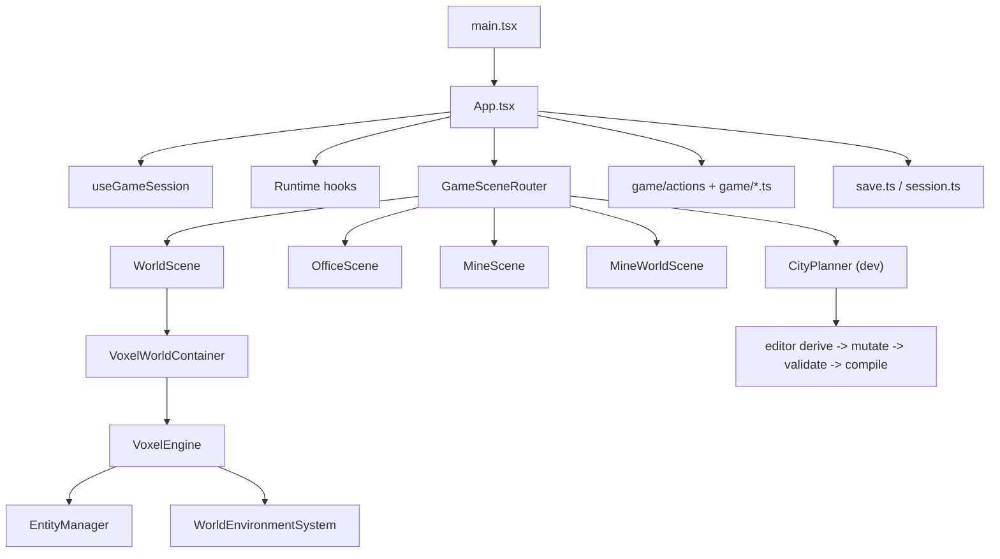

# Aureus: Below Game Engine Architecture

This document is the precise runtime map for the current client. It is not a generic game-engine essay. It is a file-by-file description of how this project actually boots, routes scenes, mutates state, renders the voxel world, advances simulation, and persists progress.

Use this when you need to answer questions like:

- Where does authority for gameplay state live?
- Which changes belong in pure rules vs hooks vs render adapters?
- How do analog movement, click-to-move, weather, time, permits, and scene routing interact?
- What exactly is "the engine" in this codebase?

## 1. Engine Definition

There is no separate native engine binary. The "engine" is the combination of:

- [`src/App.tsx`](../src/App.tsx): orchestration root and state owner
- [`src/components/GameSceneRouter.tsx`](../src/components/GameSceneRouter.tsx): scene mount boundary
- [`src/game/`](../src/game): pure rule modules, save/session, progression, transitions
- [`src/hooks/game/`](../src/hooks/game): continuous schedulers
- [`src/components/WorldScene.tsx`](../src/components/WorldScene.tsx): world-scene orchestration and input funnel
- [`src/components/VoxelWorldContainer.tsx`](../src/components/VoxelWorldContainer.tsx): React-to-engine bridge
- [`src/VoxelEngine.ts`](../src/VoxelEngine.ts): Three.js runtime, camera, picking, meshing, frame loop
- [`src/EntityManager.ts`](../src/EntityManager.ts): buildings, NPCs, player entity runtime
- [`src/lighting/WorldEnvironmentSystem.ts`](../src/lighting/WorldEnvironmentSystem.ts): sky, fog, light, precipitation, celestial rig

The hard rule is simple: React owns truth, the voxel engine owns rendering and low-level interaction, and pure game modules own domain rules.

## 2. Core Constraints

The architecture is shaped by a few non-negotiables:

1. `GameState` must stay serializable so LocalStorage saves, hydration, and smoke regression seeding stay simple.
2. Scene surfaces must be swappable from one shared state tree instead of carrying private copies of gameplay truth.
3. Expensive world rendering must stay behind a boundary so shell/UI work does not leak into Three.js internals.
4. Continuous behavior is split into focused schedulers instead of one god-loop in React.
5. Dev authoring tools must not mutate runtime world data until compilation/apply time.

## 3. Runtime Map



## 4. Authoritative State Model

The entire live run is held in one `useState<GameState>` inside [`src/App.tsx`](../src/App.tsx). The shape is declared in [`src/types.ts`](../src/types.ts).

### State slices

| Slice | Source fields | Responsibility |
| --- | --- | --- |
| Resources | `money`, `ore`, `evidence`, `energy`, `upgrades`, `dirtItems` | Economy and player inventory |
| Office | `foundOfficeItemIds`, `explorationActive` | Office/interior exploration |
| Meters | `meters.trust`, `meters.influence`, `meters.exposure` | Political and narrative pressure |
| Progression | `permits`, `npcs`, `objectives`, `mines`, `activeMineId`, `unlockedEndings` | Campaign structure |
| Interaction | `currentScene`, `activeNPCId`, `activePermitId`, `activeBuildingId`, `activeMiniGame`, `activeEndingId` | What the player is actively looking at |
| World | `buildings`, `navigationZones`, `day`, `time`, `weather`, `playerPos`, `targetPos`, `path`, `streetPickups` | Traversal and world simulation |
| Narrative | `feedbacks`, `playerFeedbacks`, `dialogueCooldowns`, `worldEffects`, `storyFlags`, `lastCityEventHour` | Temporary effects and route state |
| FTUE | `ftuePhase`, `tutorialStep`, `tutorialMinimized` | Onboarding funnel state |

### Why this matters

- Save/load is just `GameState` inside an envelope.
- Smoke tests can seed exact scenarios by writing LocalStorage directly.
- Every scene can render from the same truth without bespoke adapters.

## 5. Boot And Session Flow

Boot is controlled by [`src/hooks/app/useGameSession.ts`](../src/hooks/app/useGameSession.ts), not by ad hoc startup logic in scene components.

### Entry sequence

1. [`src/main.tsx`](../src/main.tsx) mounts `App`.
2. `App` initializes state with `buildInitialGameState()` from [`src/game/session.ts`](../src/game/session.ts).
3. `useGameSession()` checks LocalStorage via [`src/game/save.ts`](../src/game/save.ts).
4. The shell stays on [`src/components/StartScreen.tsx`](../src/components/StartScreen.tsx) until the user chooses:
   - `New Game`
   - `Continue`
   - `Open Planner` in dev
5. If booting into `WORLD`, startup loading is held open until the world renderer reports ready through `GameSceneRouter -> WorldScene -> VoxelWorldContainer`.

### Session modes

`useGameSession()` uses two explicit session modes:

- `game`
- `planner-home`

That distinction matters because planner-from-home is not a normal gameplay session and should not behave like one.

### Save behavior

- First save in a new/continued session is forced immediately.
- Subsequent saves are debounced by 500 ms.
- Current envelope shape:

```json
{
  "version": 2,
  "savedAt": "ISO timestamp",
  "state": { "...GameState..." }
}
```

- Save key metadata is centralized in [`src/game/saveMetadata.json`](../src/game/saveMetadata.json).
- Legacy keys are still read as fallback.

## 6. Scene Routing Contract

[`src/components/GameSceneRouter.tsx`](../src/components/GameSceneRouter.tsx) is the mount boundary for heavy surfaces.

### Inputs

- Full `GameState`
- Shell handlers from `App`
- Initial-scene readiness callbacks
- Planner enablement flag

### Outputs

- Exactly one mounted scene surface
- Optional mine picker modal
- Initial-mount signals back to the startup loader

### Renderable scene policy

[`src/game/scenePolicy.ts`](../src/game/scenePolicy.ts) normalizes `state.currentScene` into what is actually allowed to render:

- `CITY_PLANNER` only if dev planner is enabled
- `MINE_WORLD`, `MINE`, `WORLD` are passed through directly
- everything else falls back to `OFFICE`

That prevents scene-policy drift across `App`, nav UI, and scene components.

## 7. Mutation Taxonomy

This project uses three mutation paths. Mixing them is where architecture rot starts.

### A. Immediate UI transitions

Files:

- [`src/game/uiTransitions.ts`](../src/game/uiTransitions.ts)
- [`src/game/sceneTransitions.ts`](../src/game/sceneTransitions.ts)

Use these for:

- opening/closing overlays
- selecting NPCs or permits
- entering/leaving office surfaces
- switching into planner or mine-world scenes

### B. Pure domain actions

Files:

- [`src/game/actions/mineActions.ts`](../src/game/actions/mineActions.ts)
- [`src/game/actions/permitActions.ts`](../src/game/actions/permitActions.ts)
- [`src/game/actions/evidenceActions.ts`](../src/game/actions/evidenceActions.ts)
- [`src/game/actions/dialogueActions.ts`](../src/game/actions/dialogueActions.ts)
- [`src/game/economy.ts`](../src/game/economy.ts)
- [`src/game/navigationActions.ts`](../src/game/navigationActions.ts)
- [`src/game/runCycle.ts`](../src/game/runCycle.ts)

Use these for:

- mining a tile
- submitting permits
- exporting ore
- traveling to a mine
- applying office operation actions
- dialogue consequences

These modules should return the next state plus notifications where needed. JSX should not invent game rules inline.

### C. Continuous schedulers

Files under [`src/hooks/game/`](../src/hooks/game) advance systems over time with dedicated timers or frame loops.

## 8. Scheduler Cadence

The runtime is intentionally split into subsystem schedulers instead of a monolithic React tick.

| Hook / system | File | Cadence | Responsibility |
| --- | --- | --- | --- |
| Movement loop | [`useMovementLoop.ts`](../src/hooks/game/useMovementLoop.ts) | `setInterval(..., 70)` | Walk path nodes, drain energy, collect street pickups, trigger collapse |
| Time + curfew loop | [`useTimeAndCurfewLoop.ts`](../src/hooks/game/useTimeAndCurfewLoop.ts) | `setInterval(..., 1000)` | Advance world clock, roll weather, apply ambient exposure/energy, trigger daily economy |
| Permit processing loop | [`usePermitProcessingLoop.ts`](../src/hooks/game/usePermitProcessingLoop.ts) | `setInterval(..., 3000)` | Resolve pending permits probabilistically and unlock downstream content |
| City event loop | [`useCityEventLoop.ts`](../src/hooks/game/useCityEventLoop.ts) | `setInterval(..., 2500)` | Inject hourly city events and route-sensitive world effects |
| Feedback cleanup | [`useFeedbackCleanup.ts`](../src/hooks/game/useFeedbackCleanup.ts) | `setInterval(..., 500)` | Expire floating relationship and player feedback UI data |
| Tutorial progression | [`useTutorialProgression.ts`](../src/hooks/game/useTutorialProgression.ts) | effect-driven | Advance FTUE when state reaches milestones |
| Building discovery | [`useBuildingDiscovery.ts`](../src/hooks/game/useBuildingDiscovery.ts) | effect-driven | Unlock buildings/objectives from state changes |
| Analog movement | [`useContinuousAnalogMovement.ts`](../src/hooks/game/useContinuousAnalogMovement.ts) | `requestAnimationFrame` | Compute smooth analog displacement against surface-map walkability |
| Render frame | [`VoxelEngine.animate()`](../src/VoxelEngine.ts) | `requestAnimationFrame` | Interpolate player pose, update camera, weather lighting, physics, NPC visuals, render scene |

This split is one of the stronger decisions in the codebase. It keeps subsystem ownership legible.

## 9. Input Pipelines

### Click-to-move world navigation

Path:

1. `WorldScene` receives a ground/building/NPC selection from `VoxelWorldContainer`.
2. For ground movement it calls `onMove(...)`.
3. `App.handleMove()` computes a path with [`findPath`](../src/utils/pathfinding.ts).
4. [`applyPlannedWorldMove`](../src/game/navigationActions.ts) stores `path` and `targetPos`.
5. `useMovementLoop()` consumes the path over time.

### Analog movement

Path:

1. [`src/components/AnalogStick.tsx`](../src/components/AnalogStick.tsx) emits vector input.
2. `WorldScene` passes that vector into [`useContinuousAnalogMovement.ts`](../src/hooks/game/useContinuousAnalogMovement.ts).
3. That hook:
   - rotates input by `WORLD_CAMERA_AZIMUTH`
   - applies deadzone, acceleration, deceleration, and bounds
   - checks candidate motion against `WorldSurfaceMap`
   - emits rounded tile updates through `onDirectMove`
4. `App.handleDirectMove()` calls [`applyDirectWorldMove`](../src/game/navigationActions.ts) using the cached surface map.
5. Authoritative `playerPos` is updated in `GameState`, while the hook also keeps a smoother local render position.

The important split is this: analog movement has a local smoothing layer, but authoritative movement still lands back in `GameState`.

### World interaction

Selection is handled inside `WorldScene`:

- `GROUND` -> route/move
- `NPC` -> move into range or enter office NPC interaction
- `BUILDING` -> prompt entry or route to access point

FTUE can override normal interaction and force the player toward the Bureau.

## 10. World Navigation Stack

World navigation is built on real authored geometry, not fake blockers.

Files:

- [`src/utils/worldNavigation.ts`](../src/utils/worldNavigation.ts): building footprints, access points, structure heights
- [`src/utils/buildingAccess.ts`](../src/utils/buildingAccess.ts): safe entry positions
- [`src/utils/pathfinding.ts`](../src/utils/pathfinding.ts): 8-direction pathfinding
- [`src/utils/worldSurface.ts`](../src/utils/worldSurface.ts): walkable surface map, terrain height lookup, terrain voxel generation
- [`src/utils/voxelConstants.ts`](../src/utils/voxelConstants.ts): shared dimensions such as `WORLD_SIZE` and `WORLD_HALF_SIZE`

Key consequences:

- movement validity is grounded in the same layout the renderer uses
- direct movement and pathfinding both consult the surface map
- planner-compiled navigation zones can block routes without hardcoding logic into scenes

## 11. World Scene Rendering Pipeline

[`src/components/WorldScene.tsx`](../src/components/WorldScene.tsx) is the orchestration layer for the explorable city.

### It computes

- terrain voxels via `buildWorldTerrainVoxels(...)`
- pickup voxels via `buildStreetPickupVoxels(...)`
- objective target markers for FTUE
- building prompt state
- hover/selection throttling via `requestAnimationFrame`
- analog movement state

### It does not own

- Three.js objects
- render loop timing
- camera math
- entity instantiation
- lighting systems

That is the correct boundary.

## 12. React-To-Engine Bridge

[`src/components/VoxelWorldContainer.tsx`](../src/components/VoxelWorldContainer.tsx) is the adapter between React state and the low-level voxel engine.

### Creation phase

On first mount it:

1. creates `VoxelEngine`
2. calls `loadInitialModel(voxels)`
3. calls `setPickupVoxels(pickupVoxels)`
4. registers buildings and NPCs through `EntityManager`
5. initializes NPC commuting with navigation zones
6. syncs time, weather, player position, path, and target
7. reports boot progress back to the shell

### Update phase

Dedicated effects later drive:

- terrain remesh updates
- pickup remesh updates
- building/NPC re-registration
- time sync
- weather sync
- player position/path sync
- objective marker sync
- callback sync
- player work/carry visual state

This file is the contract wall. If React starts reaching straight into `VoxelEngine` from random components, the boundary is broken.

## 13. VoxelEngine Responsibilities

[`src/VoxelEngine.ts`](../src/VoxelEngine.ts) is a real runtime subsystem, not a dumb canvas wrapper.

### What it owns

- Three.js scene, camera, renderer, orbit controls
- physics world (`cannon-es`)
- terrain instancing and meshing
- pickup mesh layer
- target and path indicators
- picking / hover / selection callbacks
- camera follow and recenter behavior
- frame loop
- rebuild/dismantle toy-box mechanics still present in the engine

### Public gameplay-facing methods currently used by the app

- `loadInitialModel(data)`
- `setPickupVoxels(data)`
- `updateTime(time)`
- `updateWeather(weather)`
- `setPlayerPosition(x, z, surfaceY, isMoving, targetX, targetZ, path)`
- `setObjectiveTarget(target)`
- `setCallbacks(...)`
- `recenterOnPlayer()`
- `cleanup()`

### Meshing detail

`loadInitialModel()` eventually routes into `createVoxels(...)`, which uses [`GreedyMesher`](../src/utils/GreedyMesher.ts) for terrain batching. That is why pickup rendering was split out separately: pickups can change often, terrain should not remesh for every tiny interaction.

### Frame loop detail

`animate()` does, in order:

1. compute delta time
2. snap player Y to terrain surface
3. interpolate player X/Z toward authoritative target
4. update player facing
5. update camera follow
6. update environment system with time/weather/focus
7. update controls and physics
8. update entity manager
9. pulse target/objective indicators
10. draw and render

That means render smoothness is handled inside the engine, while coarse gameplay truth remains in React state.

## 14. Entity Runtime

[`src/EntityManager.ts`](../src/EntityManager.ts) owns render-time actors.

### Managed entity classes

- `VoxelCharacter` for player and NPCs
- `VoxelBuilding` for buildings

### Responsibilities

- create building meshes from authored voxel sets
- attach interaction colliders
- spawn NPCs with per-NPC palettes
- build NPC commute state from home/work buildings
- advance NPC commute phases by world time
- manage a pool of street-light point lights near the player

Important distinction: NPC commute is visual/runtime behavior in the engine layer. Story, trust, permits, and route logic remain in `GameState`.

## 15. Environment And Weather Pipeline

Weather is a cross-cutting system with explicit boundaries.

### Simulation

[`src/game/weatherSystem.ts`](../src/game/weatherSystem.ts) owns:

- weather presets and transitions
- ambient exposure/energy effects
- movement modifiers
- travel modifiers
- economy modifiers
- mining modifiers
- tone/warning labels for UI

### Time integration

[`useTimeAndCurfewLoop.ts`](../src/hooks/game/useTimeAndCurfewLoop.ts) advances weather with `advanceWeatherState(...)` and applies ambient penalties.

### Gameplay integration

- movement: `useMovementLoop` via `getWeatherMovementMultiplier(...)`
- travel: `applyMineTravel(...)`
- economy: [`src/game/economy.ts`](../src/game/economy.ts)
- mining: [`src/game/actions/mineActions.ts`](../src/game/actions/mineActions.ts)

### Rendering integration

[`src/lighting/WorldEnvironmentSystem.ts`](../src/lighting/WorldEnvironmentSystem.ts) converts time + weather into:

- background color
- fog color / range
- ambient, hemisphere, and directional light intensity
- sun/moon positions
- precipitation instancing
- storm lightning flashes

This is clean architecture. Simulation chooses weather; renderer interprets it.

## 16. Office And Operations Layer

The office scene is not just a menu surface.

Files:

- [`src/components/OfficeScene.tsx`](../src/components/OfficeScene.tsx)
- [`src/game/officeViewModel.ts`](../src/game/officeViewModel.ts)
- [`src/game/runCycle.ts`](../src/game/runCycle.ts)
- [`src/components/RunCyclePanel.tsx`](../src/components/RunCyclePanel.tsx)
- [`src/components/PoliticalPositionPanel.tsx`](../src/components/PoliticalPositionPanel.tsx)

`runCycle.ts` turns the campaign into explicit operation phases:

- `SECURE`
- `PREPARE`
- `EXECUTE`
- `RESOLVE`
- `POLITICAL`

This is strategically important because it keeps the game from collapsing into disconnected minigames. Permit pressure, prep windows, extraction, market resolution, and political route choice are all visible as one loop.

## 17. Mine Layer

The mine subsystem is split into two surfaces:

- `MINE`: 2D tile-board gameplay via [`src/components/MineScene.tsx`](../src/components/MineScene.tsx)
- `MINE_WORLD`: 3D shaft surface via [`src/components/MineWorldScene.tsx`](../src/components/MineWorldScene.tsx)

Travel into the mine is resolved in [`src/game/navigationActions.ts`](../src/game/navigationActions.ts):

- validates discovery
- checks weather-adjusted travel time and energy cost
- can trigger exhaustion collapse
- switches `currentScene` to `MINE`
- sets `activeMineId`

The mine rules themselves live in [`src/game/actions/mineActions.ts`](../src/game/actions/mineActions.ts), which is where mining balance should stay.

## 18. Planner / Authoring Pipeline

The dev-only city planner is intentionally a separate subsystem.

Files:

- [`src/components/CityPlanner.tsx`](../src/components/CityPlanner.tsx)
- [`src/hooks/editor/useCityPlannerEditor.ts`](../src/hooks/editor/useCityPlannerEditor.ts)
- [`src/editor/derive.ts`](../src/editor/derive.ts)
- [`src/editor/sceneMutations.ts`](../src/editor/sceneMutations.ts)
- [`src/editor/validation.ts`](../src/editor/validation.ts)
- [`src/editor/compiler.ts`](../src/editor/compiler.ts)
- [`src/editor/storage.ts`](../src/editor/storage.ts)

Pipeline:

1. derive editable authoring scene from runtime state
2. mutate authoring state with editor tools
3. validate overlaps, bounds, pathing, bindings
4. compile back into runtime-safe buildings and navigation zones
5. apply into live game only through `applyPlannerWorld(...)`

This separation is correct. Editor churn should not contaminate runtime rules until compilation succeeds.

## 19. Save And Regression Architecture

### Save layer

[`src/game/save.ts`](../src/game/save.ts) is intentionally boring:

- validates that loaded data at least looks like `GameState`
- reads from current and legacy save keys
- stores the versioned envelope
- swallows LocalStorage failure as best-effort behavior

### Hydration layer

[`src/game/session.ts`](../src/game/session.ts) handles normalization:

- restored buildings
- navigation zones fallback
- weather fallback
- spawn reset for legacy world layouts
- planner-scene downgrade if planner is disabled
- FTUE migration from old tutorial-step semantics

Hydration belongs here, not in components.

### Regression harness

[`scripts/smoke-regression.mjs`](../scripts/smoke-regression.mjs) proves the architecture is still coherent across:

- title screen boot
- new-game flow
- FTUE start
- analog stick movement
- save persistence
- mine scene navigation

It seeds and mutates LocalStorage directly using the same save metadata constants the app uses. Good. That avoids setup theatre.

## 20. Real Pressure Points

These are the actual structural weak spots right now:

### 1. `App.tsx` is still too central

It is better than a giant monolith used to be, but it still knows too much about:

- scene wiring
- notifications
- debug tracking
- market flow
- travel flow
- overlay opening
- action fan-out

If feature growth continues, the next clean split is probably an app-level controller hook or reducer-style action dispatcher.

### 2. `VoxelEngine.ts` is carrying old toy-box/editor DNA

The engine still includes dismantle/rebuild/export/editor-ish behaviors that are not part of the main game loop. They are not breaking runtime, but they do increase surface area and cognitive load.

### 3. World rendering remains the highest complexity zone

Anything touching these files needs care:

- [`src/components/WorldScene.tsx`](../src/components/WorldScene.tsx)
- [`src/components/VoxelWorldContainer.tsx`](../src/components/VoxelWorldContainer.tsx)
- [`src/VoxelEngine.ts`](../src/VoxelEngine.ts)
- [`src/EntityManager.ts`](../src/EntityManager.ts)

This is where performance regressions and boundary leaks will happen first.

### 4. Continuous systems are still timer-based, not deterministic simulation steps

That is acceptable for this project right now, but it means:

- balancing is partly wall-clock driven
- background-tab browser behavior can affect cadence
- exact determinism is limited

Do not pretend this is a lockstep simulation architecture. It is not.

## 21. Extension Rules

If you add features, follow this order:

1. Extend `GameState` only if the data belongs in the saveable model.
2. Put rule mutations in `src/game/` or `src/game/actions/` first.
3. Add a hook only if the feature is genuinely continuous over time.
4. Keep scene components as orchestration/view layers.
5. Keep `VoxelWorldContainer` as the only React-to-engine bridge.
6. Treat `VoxelEngine` as a render/input adapter, not the source of campaign truth.
7. Extend the smoke regression if the feature touches a critical route.

## 22. Fast Reading Order

If someone needs to understand the engine fast, read in this order:

1. [`src/types.ts`](../src/types.ts)
2. [`src/App.tsx`](../src/App.tsx)
3. [`src/hooks/app/useGameSession.ts`](../src/hooks/app/useGameSession.ts)
4. [`src/components/GameSceneRouter.tsx`](../src/components/GameSceneRouter.tsx)
5. [`src/game/session.ts`](../src/game/session.ts)
6. [`src/game/save.ts`](../src/game/save.ts)
7. [`src/game/navigationActions.ts`](../src/game/navigationActions.ts)
8. [`src/hooks/game/useMovementLoop.ts`](../src/hooks/game/useMovementLoop.ts)
9. [`src/hooks/game/useTimeAndCurfewLoop.ts`](../src/hooks/game/useTimeAndCurfewLoop.ts)
10. [`src/components/WorldScene.tsx`](../src/components/WorldScene.tsx)
11. [`src/components/VoxelWorldContainer.tsx`](../src/components/VoxelWorldContainer.tsx)
12. [`src/VoxelEngine.ts`](../src/VoxelEngine.ts)
13. [`src/EntityManager.ts`](../src/EntityManager.ts)
14. [`src/lighting/WorldEnvironmentSystem.ts`](../src/lighting/WorldEnvironmentSystem.ts)

That path gives you authority, mutation flow, scheduling, and rendering in the right order instead of making you bounce around blind.
